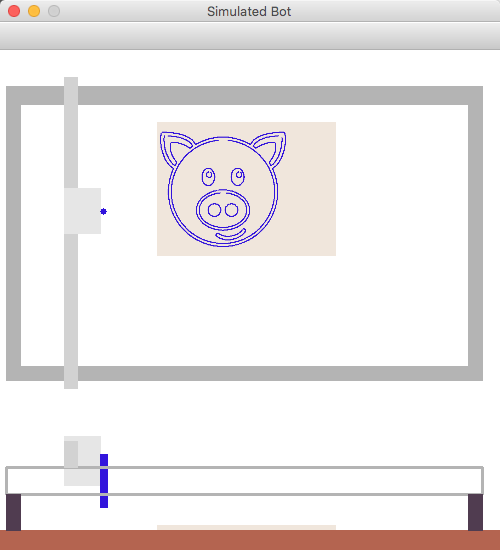
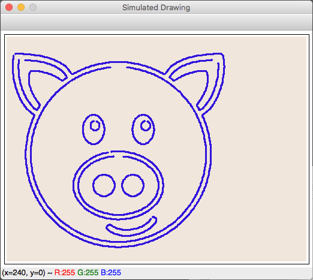

The goal of this code is to help simplify the testing and sending of commands to the painting robot available at http://robotart.org

## Running the demo examples ##

You can simulate how the bot will work before sending commands to the physical bot.  There are two ways to do it.

## Direct commands to the simulation ##

At the command line, just run:

cd python/bot
python3 bot_demo.py

This demo will create a bot object, open the simluation of the bot and it's drawing/painting, and simulate the drawing.  The drawing itself is just the contour lines of a sample image.

## Send commands to a socket server ##

This is useful if you're writing code in another language than python or want to run the bot on a different computer than the one with your scripts.  

First, on the computer where the bot is connected, run this command

```
cd python/bot
python3 bot_server.py
```

It will open a window that shows a simulation of the bot (so you can see it without having to have a physical bot)

Then, you can send commands to it just like in the simulation.  To see a demo, just edit the line in bot_demo.py of

```
use_bot_server = False
```

to 

```
use_bot_server = True
```

save the file and then run

```
cd python/bot
python3 bot_demo.py
```

The bot_demo.py script will run the same but now send the commands to the bot server.

## Example screenshots of the bot simulator ##

Simulation of the bot.


Simulated drawing by the bot.


## C++ bot client ##

cpp/bot_client.cpp has a c++ example that can connect to the bot socket server.  Note: you must first start the bot socket server (see above) before it will work.

## Required Libraries ##

python3, opencv, numpy

Here is an example of how to install it them on Windows
https://www.youtube.com/watch?v=iqz-UmAxvTo


